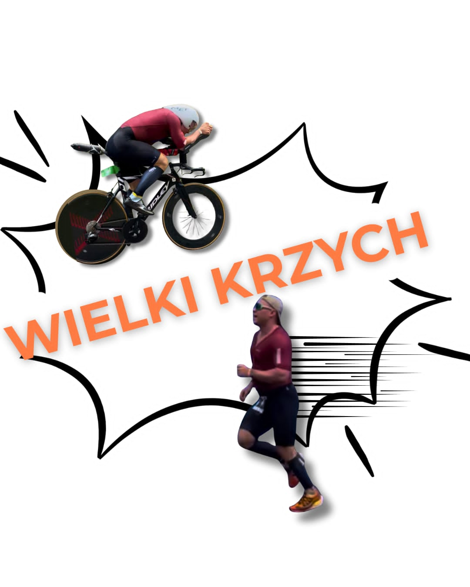

# 🚴 Tri_Dashboard

<div align="center">



[](https://www.python.org/)
[](https://streamlit.io/)
[](LICENSE)
[](tests/)

**Advanced Physiological Analysis Platform for Triathletes**

[Features](#-features) • [Install](#-installation) • [Stack](#-tech-stack) • [License](#-license)

</div>

---

## 🔬 Overview

Tri_Dashboard to platforma analityczna dla **trenerów**, **naukowców sportu** i **zaawansowanych atletów**. Oferuje:

- 🔬 Wielosensorowa fuzja danych (SmO2, HRV, wentylacja)
- 🤖 AI Coach z diagnozą limitów wydolnościowych
- 📊 Automatyczna detekcja progów (VT1/VT2, LT1/LT2)
- 📈 Generowanie raportów PDF/DOCX z confidence scoring
- ⚡ Wysoka wydajność (Polars, Numba, caching)

---

## ⭐ Features

| Moduł | Funkcjonalność |
|:-------|:---------------|
| **Power** | PDC, CP/W', NP, IF, TSS, phenotype klasyfikacja |
| **Physiology** | SmO2 kinetics, HRV (DFA α1), termoregulacja, biomechanika |
| **Thresholds** | 4-point CPET: VT1_onset, VT1_steady, RCP_onset, RCP_steady |
| **AI Coach** | Multi-sensor fusion, limiter diagnosis, rekomendacje |
| **Reports** | PDF 7-stronicowy, DOCX, PNG export, SQLite baza danych |

### Supported Data Formats
- **Import**: FIT, TCX, CSV (Garmin, TrainingPeaks, Intervals.icu)
- **NIRS**: TrainRed, Moxy (auto-detekcja)

---

## 🛠️ Tech Stack

| Warstwa | Technologia |
|:--------|:------------|
| UI | Streamlit |
| Data | Polars + Pandas |
| Analysis | SciPy, NumPy, Statsmodels |
| HRV | NeuroKit2 |
| Acceleration | Numba JIT, MLX (Apple Silicon) |
| Reports | ReportLab, python-docx |
| Viz | Matplotlib, Plotly |
| Storage | SQLite |

---

## 📥 Installation

```bash
# Clone
git clone https://github.com/WielkiKrzych/Tri_Dashboard.git
cd Tri_Dashboard

# Install
pip install -r requirements.txt

# Run
streamlit run app.py
```

---

## 📂 Project Structure

```
Tri_Dashboard/
├── app.py                  # Main Streamlit app
├── modules/
│   ├── calculations/       # Core algorithms (VT, SmO2, power, HRV...)
│   ├── ui/                # Streamlit tabs & components
│   ├── reporting/         # PDF/DOCX generators
│   ├── frontend/          # Theme, state, layout
│   ├── db/                # SQLite session store
│   ├── ai/                # AI Coach & interval detection
│   └── cache_utils.py     # Caching layer (40+ cached functions)
├── services/              # Data pipeline orchestrator
├── tests/                 # 40+ test files
└── assets/                # Logo, backgrounds
```

---

## ⚡ Performance

| Operation | Speedup |
|:----------|:--------|
| Rolling Mean | 10-50x (Numba) |
| GroupBy | 10-100x (Polars) |
| DataFrame Ops | 10x (vectorized) |
| Column Mapping | 5-10x (O(1) lookup) |
| Caching | TTL-based memoization |

---

## 📄 License

MIT License - zobacz [LICENSE](LICENSE) file.

---

## ⚠️ Disclaimer

> **To oprogramowanie służy wyłącznie celom edukacyjnym i treningowym.** Nie jest urządzeniem medycznym i nie może być używane do diagnozowania lub leczenia schorzeń. Zawsze konsultuj się z wykwalifikowanymi specjalistami.

---

<div align="center">

⭐ Star na GitHubie | 🍴 Fork | 👁️ Watch

</div>
