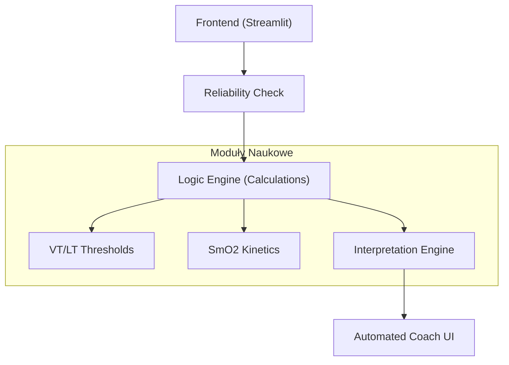

# Tri_Dashboard: Zaawansowana Platforma Analizy Fizjologicznej

## Cel
Tri_Dashboard to specjalistyczna platforma analityczna zaprojektowana dla naukowców sportowych oraz elitarnych trenerów. Wykracza poza standardowe metryki, oferując **probabilistyczne modelowanie fizjologiczne**.

Kluczowe moduły:
- **Analiza Wentylacyjna (VT)**: Detekcja stref VT1/VT2 z analizą histerezy ("Ramp Up" vs "Ramp Down") i badaniem wrażliwości (Sensitivity Analysis).
- **Progi SmO2 (NIRS)**: Analiza kinetyki mięśniowej z uwzględnieniem kontekstu (np. "Mechanical Occlusion" vs "Metabolic Demand").
- **Reliability Engine**: System "strażnika jakości", który blokuje analizę w przypadku wykrycia błędów protokołu (np. nieliniowy ramp test) lub szumu sygnałowego.
- **Automated Coach**: Silnik interpretacji tłumaczący wyniki ("Slow Recovery Kinetics") na konkretne zalecenia treningowe ("Zone 2 Base").

## Przegląd Architektury
Aplikacja wykorzystuje modularną **Architekturę Zorientowaną na Usługi (SOA)** w ramach monolitycznego kodu.



## Funkcjonalności

### 1. Robust VT Detection (Analiza Progów)
Zamiast "jednego punktu", system wyznacza **Strefy Pewności (Confidence Zones)**.
- **Histereza**: Porównuje moce progowe podczas narastania (skupienie) i opadania (zmęczenie/recovery).
- **Sensitivity Analysis**: Uruchamia algorytm na różnych oknach wygładzania. Jeśli wynik jest niestabilny, użytkownik otrzymuje ostrzeżenie "Low Reliability".

### 2. SmO2 Context & Lag
Algorytm nie patrzy tylko na spadek tlenu, ale wyjaśnia **DLACZEGO** on nastąpił:
- **Delivery Limitation**: Serce nie nadąża (Płaskie SmO2 przy rosnącym HR).
- **Utilization Issue**: Mięsień nie pobiera tlenu mimo dostępności.
- **Mechanical Occlusion**: Zbyt niska kadencja blokuje przepływ ("Grinding").
- **Lag Analysis**: Mierzy opóźnienie czasowe (w sekundach) między zmianą mocy a reakcją SmO2/HR.

### 3. Reliability & Warning System
System "Gatekeeper". Jeśli wgrasz plik ze stałą jazdą i nazwiesz go "Ramp Test", system to wykryje (Slope < 0.05 W/s) i **zablokuje** detekcję progów, chroniąc przed fałszywymi wynikami.

### 4. Interpretation Engine
Moduł "Trenera":
- **Diagnoza**: "Profil Diesel" (Wysokie VT1, Niskie VLamax).
- **Recepta**: "Trening Polaryzacyjny: Dodaj interwały VO2max".

## Instrukcja Instalacji

### Wymagania Wstępne
- Python 3.10 lub nowszy
- Menedżer pakietów `pip`

### Instalacja
1.  Sklonuj repozytorium:
    ```bash
    git clone https://github.com/WielkiKrzych/Tri_Dashboard.git
    cd tri_dashboard
    ```
2.  Zainstaluj zależności:
    ```bash
    pip install -e .[dev]
    ```

### Uruchomienie Dashboardu
```bash
streamlit run app.py
```
Dostęp pod adresem `http://localhost:8501`.

## Użycie
1. **Wgraj Plik**: Obsługuje `.fit`, `.tcx`, `.csv` (Garmin, Wahoo, TrainRed).
2. **Sprawdź Jakość**: Zobacz "Reliability Score" w podsumowaniu.
3. **Analizuj**: Przejdź do zakładki "SmO2" lub "Ventilation" aby zobaczyć wykresy z zaznaczonymi strefami niepewności.
4. **Wnioski**: Przeczytaj sekcję "Automated Coach" na dole strony głównej.
