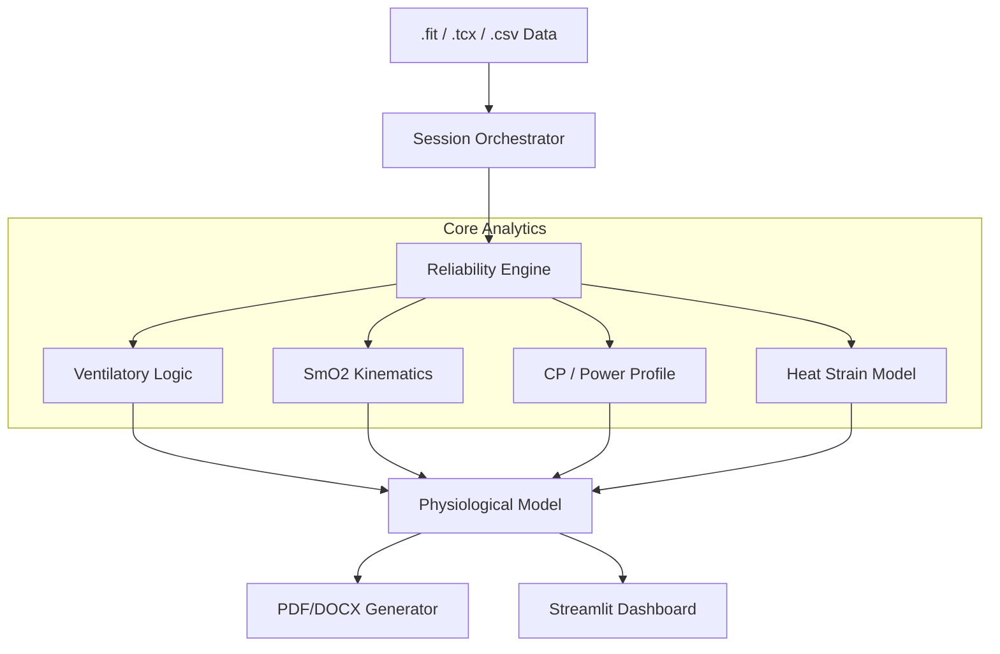

# 🚴‍♂️ Tri_Dashboard: Advanced Physiological Analysis Platform


Tri_Dashboard is a specialized analytical platform designed for sports scientists, coaches, and advanced athletes. It provides **probabilistic physiological modeling** with a focus on raw data transparency, multi-sensor integration (SmO2, VO2 Master), and automated coaching insights.

## 🚀 Key Modules & Features

### 📄 Ramp Test Analytics & Reporting (New!)
A fully automated pipeline for analyzing metabolic ramp tests.
- **Automated Threshold Detection**: 
    - **Ventilation (VT1/VT2)** using V-slope and Ventilatory Equivalents.
    - **SmO2 (LT1/LT2)** kinetics using NIRS data (Moxy/TrainRed).
- **Pro-Level Reporting**: Generates **PDF** and editable **DOCX** reports.
    - **Educational Content**: "Why it matters" blocks explaining metrics to athletes.
    - **Advanced Metrics**: Biomechanics (Torque vs Cadence), Metabolic Model (VO2max/VLaMax balance), Cardiac Drift Heatmaps, and Thermal Efficiency.
- **Ramp Archive**: Store and compare historical test results.

### ⚡ Performance Analytics
- **Power Duration Curve (PDC)**: Log-log modeling of your power profile. Includes **Critical Power (CP)** fitting, W' (Anaerobic Work Capacity), and **Phenotype Classification** (e.g., Sprinter, TT Specialist).
- **Advanced Metrics**:
    - **Time-to-Exhaustion (TTE)**: Estimations for 90-110% FTP.
    - **Durability Index**: How your power degrades over time.
    - **Recovery Score**: W' reconstitution tracking.
- **Intervals Generator**: Convert structured workout JSONs (ZwoFactory/Intervals.icu) into universally compatible CSVs for TrainingPeaks/Garmin.

### 🫀 Physiology & Biometrics
- **SmO2 (NIRS)**: Deep dive into muscle oxygenation. Includes **Re-saturation Analysis** and "Muscle Oxygen Kinetics" modeling.
- **HRV (DFA a1)**: Estimation of aerobic threshold (AerT) using heart rate variability dynamics.
- **Thermal Analysis**: 
    - **Heat Strain Index (HSI)**: Cumulative heat load tracking.
    - **Efficiency Drop**: Correlation between core temperature rise and efficiency loss (Cardiac Drift).
- **Biomechanics**: Analysis of Cadence vs Torque relationships to identify mechanical limiters.

### 🧠 Intelligence & AI
- **Limiters**: Automated diagnosis of performance bottlenecks (e.g., O2 transport vs. Utilization).
- **AI Coach**: GPT-integrated interpretation layer providing actionable advice based on multi-sensor data fusion.

## 🛠 Technical Architecture

The platform uses a modular, service-oriented architecture:

- **`modules/reporting`**: PDF/DOCX builders, figure generation, and layout logic.
- **`modules/calculations`**: Core physics and physiology algorithms (power, metabolic, thermal).
- **`modules/ui`**: Streamlit components for each analytic tab.
- **`modules/data`**: NIRS/FIT file parsers and database interaction.



## 💻 Tech Stack

- **Frontend**: [Streamlit](https://streamlit.io/) for interactive data visualization.
- **Data Processing**: [Polars](https://pola.rs/) & [Pandas](https://pandas.pydata.org/) for high-performance data manipulation.
- **Analysis**: [SciPy](https://scipy.org/) (curve fitting), [NumPy](https://numpy.org/).
- **Reporting**: [ReportLab](https://pypi.org/project/reportlab/) (PDF), [python-docx](https://python-docx.readthedocs.io/) (Word).
- **Visualization**: [Matplotlib](https://matplotlib.org/) (static reports), [Plotly](https://plotly.com/) (interactive UI).

## ⚙️ Installation & Usage

### 1. Clone & Install
```bash
git clone https://github.com/WielkiKrzych/Tri_Dashboard.git
cd Tri_Dashboard
pip install -r requirements.txt
```

### 2. Run the Dashboard
```bash
streamlit run app.py
```

## 📄 License
This project is licensed under the MIT License.

> [!WARNING]
> **Medical Disclaimer**: This software is for educational and coaching purposes only. It is not a medical device and should not be used to diagnose or treat any health conditions.
