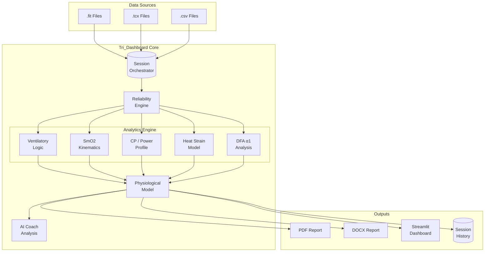

# 🚴 Tri_Dashboard

<div align="center">


[](https://www.python.org/)
[](https://streamlit.io/)
[](LICENSE)
[](tests/)
[](https://github.com/WielkiKrzych/Tri_Dashboard/commits/main)
[](https://github.com/WielkiKrzych/Tri_Dashboard/graphs/contributors)

**Advanced Physiological Analysis Platform for Triathletes**

[Features](#-key-features) • [Installation](#-installation) • [Dashboard](#-dashboard-overview) • [Architecture](#-architecture) • [Performance](#-performance)

</div>

---

## 📋 Overview

> **Tri_Dashboard** is a specialized analytical platform designed for **sports scientists**, **coaches**, and **advanced athletes**. It provides **probabilistic physiological modeling** with a focus on raw data transparency, multi-sensor integration, and automated coaching insights.

### 🎯 What Makes It Special

| Feature | Description |
|:--------|:------------|
| 🔬 **Multi-Sensor Fusion** | SmO2, VO2 Master, HRV integration |
| 📊 **Automated Threshold Detection** | VT1/VT2, LT1/LT2 with 4-point CPET model |
| 🤖 **AI-Powered Insights** | GPT Coach, limiter diagnosis |
| 📈 **Pro-Level Reporting** | PDF & DOCX exports with confidence scoring |
| ⚡ **High-Performance** | 10-100x speedup with Polars & Numba |

---

## ✨ Key Features

### 📄 Ramp Test Analytics & Reporting

> Automated pipeline for analyzing metabolic ramp tests

| Capability | Details |
|:-----------|:--------|
| **4-Point Ventilatory Model** | VT1_onset, VT1_steady, RCP_onset, RCP_steady |
| **SmO2 Kinetics** | T1 (LT1 analog), T2_onset (RCP analog) with strict ramp logic |
| **Pro Reports** | PDF & DOCX with confidence scoring (0-100%) |
| **4-Domain Zones** | Stable Aerobic → Progressive Extraction → Non-Steady Severe → Ischemic Collapse |
| **7-Page PDF Export** | Title, Overview, VE/BR, CP Model, SmO2/THb, VT1/VT2, LT1/LT2 |

### ⚡ Performance Analytics

| Metric | Implementation |
|:-------|:---------------|
| **Power Duration Curve** | Log-log modeling with CP, W' fitting |
| **Phenotype Classification** | Sprinter, TT Specialist, climber detection |
| **Time-to-Exhaustion** | 90-110% FTP with historical trends |
| **VO2max Estimation** | Sitko et al. 2021 formula with 95% CI |
| **Training Load** | TSS/CTL/ATL tracking and form estimation |

### 🫀 Physiology & Biometrics

| Sensor | Analysis |
|:-------|:---------|
| **SmO2 (NIRS)** | Re-saturation, kinetics, THb correlation |
| **Ventilation** | VE/BR dynamics, tidal volume |
| **HRV (DFA α1)** | Aerobic threshold estimation |
| **Thermal** | Heat Strain Index, cardiac drift |
| **Biomechanics** | Cadence vs Torque analysis |

### 🧠 Intelligence & AI

```
┌─────────────────────────────────────────────────────────────┐
│  🤖 AI COACH                                                │
├─────────────────────────────────────────────────────────────┤
│  • Multi-sensor data fusion                                 │
│  • Performance limiter diagnosis                            │
│  • Phenotype classification                                  │
│  • Executive summary generation                             │
└─────────────────────────────────────────────────────────────┘
```

### 📊 Data Management

| Feature | Supported Formats |
|:--------|:-----------------|
| **Import** | FIT, TCX, CSV (Garmin, TrainingPeaks, Intervals.icu) |
| **NIRS Integration** | TrainRed, Moxy automatic detection |
| **Storage** | SQLite with trend analysis |
| **Quality Engine** | Signal validation before processing |

---

## 🛠️ Architecture



### 📂 Project Structure

```
Tri_Dashboard/
├── app.py                      # 🎯 Main Streamlit application
├── modules/
│   ├── calculations/           # 🔬 Core physiology algorithms
│   │   ├── ventilatory.py     # VT1/VT2 detection
│   │   ├── smo2_advanced.py   # SmO2 kinetics
│   │   ├── power.py           # PDC, CP, W'
│   │   ├── hrv.py             # DFA α1
│   │   ├── thermal.py         # Thermoregulation
│   │   └── ...
│   ├── reporting/              # 📄 Report generators
│   │   ├── figures/           # Chart generators
│   │   └── ...
│   ├── frontend/                # 🎨 UI components
│   │   ├── theme.py
│   │   ├── state.py
│   │   └── components.py
│   └── performance/             # ⚡ Optimizations
│       ├── async_utils.py
│       ├── polars_adapter.py
│       └── numba_utils.py
├── services/
│   └── session_analysis.py     # 🔄 Data pipeline
├── models/
│   └── results.py             # 📦 Data models
└── tests/                      # 🧪 Test suite
```

---

## 💻 Tech Stack

| Category | Technology | Purpose |
|:---------|:-----------|:--------|
| **Frontend** | Streamlit | Interactive dashboard |
| **Data** | Polars + Pandas | High-performance processing |
| **Analysis** | SciPy, NumPy, Statsmodels | Curve fitting & statistics |
| **HRV** | NeuroKit2 | DFA α1 calculations |
| **Acceleration** | Numba (JIT), MLX | 10-100x speedup |
| **Reports** | ReportLab, python-docx | PDF & Word generation |
| **Viz** | Matplotlib, Plotly | Charts & visualizations |

---

## 📥 Installation

### 1. Clone the Repository

```bash
git clone https://github.com/WielkiKrzych/Tri_Dashboard.git
cd Tri_Dashboard
```

### 2. Install Dependencies

```bash
pip install -r requirements.txt
```

### 3. Run the Dashboard

```bash
streamlit run app.py
```

### 4. Run Tests (Optional)

```bash
pytest
```

---

## 📊 Dashboard Overview

### Main Tabs

| Tab | Features |
|:----|:---------|
| 📊 **Overview** | Report with KPI, Summary, DOCX/PNG/PDF export |
| ⚡ **Performance** | Power analysis, PDC, Training Load, TTE |
| 🧠 **Intelligence** | Nutrition, Limiters diagnosis, AI Coach |
| 🫀 **Physiology** | HRV, SmO2, Ventilation, Thermal, Biomechanics |

### Report with KPI Tab

> Executive summary with key performance indicators

| Category | Metrics |
|:---------|:--------|
| **Power** | Avg power, NP, work above CP |
| **Cardiovascular** | Avg HR, Power/HR, EF |
| **Oxygenation** | Avg SmO2, VO2max |
| **Thermal** | Max HSI |
| **Respiratory** | Avg VE, BR |

### Summary Tab Features

1. **Training Timeline** - Power, HR, SmO2, VE overlay
2. **Ventilation Analysis** - VE/BR with statistics
3. **CP Model** - Power-duration curve
4. **SmO2/THb** - Muscle oxygenation trends
5. **Threshold Displays** - VT1/VT2, LT1/LT2

---

## ⚡ Performance Optimizations

### Benchmark Results

| Operation | Before | After | Speedup |
|:----------|:-------|:------|:--------|
| SmO2 Breakpoint | O(n²) | O(n²/400) | **10x** |
| Step Detection | O(n²) | Optimized | **2-5x** |
| DataFrame Ops | iterrows | Vectorized | **10x** |
| DB Queries | Row-by-row | Batch | **5x** |
| Column Mapping | O(n×k) | O(1) lookup | **5-10x** |
| Rolling Mean | Pandas | Numba JIT | **10-50x** |
| GroupBy | Pandas | Polars | **10-100x** |

### Code Examples

```python
# ⚡ Async Operations
from modules.async_utils import load_data_async
df = await load_data_async(file)

# 💾 Result Caching
from modules.cache_utils import cache_result
@cache_result(ttl=3600)
def expensive_calc(data):
    return heavy_computation(data)

# 🐻‍❄️ Polars Acceleration
from modules.polars_adapter import fast_groupby_agg
result = fast_groupby_agg(df, 'category', {'value': 'mean'})

# 🚀 Numba JIT
from modules.numba_utils import fast_rolling_mean
smoothed = fast_rolling_mean(arr, window=10)
```

---

## 🔧 Development

### Running Tests

```bash
# Run all tests
pytest

# Run with coverage
pytest --cov=modules --cov-report=html

# Run specific test file
pytest tests/test_session_analysis.py -v
```

### Project Structure

```
tests/
├── test_calculations/     # Calculation module tests
├── test_integration/      # End-to-end tests
├── test_performance/      # Benchmark tests
└── conftest.py           # Pytest fixtures
```

---

## 🤝 Contributing

Contributions are welcome! Please feel free to submit a Pull Request.

1. Fork the repository
2. Create your feature branch (`git checkout -b feature/amazing-feature`)
3. Commit your changes (`git commit -m 'Add amazing feature'`)
4. Push to the branch (`git push origin feature/amazing-feature`)
5. Open a Pull Request

---

## 📄 License

This project is licensed under the **MIT License** - see the [LICENSE](LICENSE) file for details.

---

## ⚠️ Medical Disclaimer

> [!WARNING]
> **This software is for educational and coaching purposes only.** It is not a medical device and should not be used to diagnose or treat any health conditions. Always consult with qualified healthcare professionals for medical advice.

---

<div align="center">

**Made with ❤️ for triathletes and sports scientists**

[](https://github.com/WielkiKrzych/Tri_Dashboard/stargazers)
[](https://github.com/WielkiKrzych/Tri_Dashboard/network)
[](https://github.com/WielkiKrzych/Tri_Dashboard/watchers)

</div>
