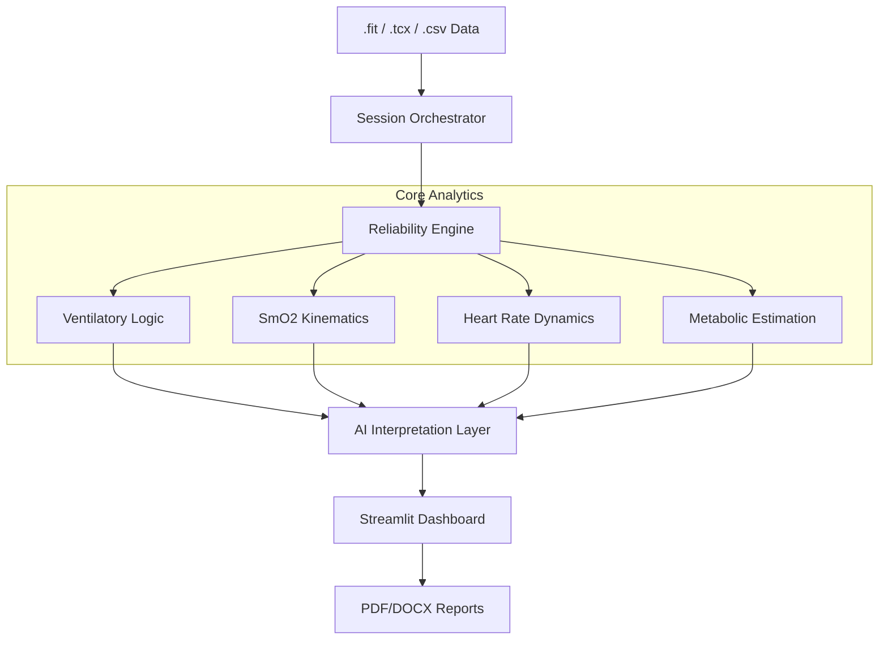

# 🚴‍♂️ Tri_Dashboard: Advanced Physiological Analysis Platform


Tri_Dashboard is a specialized analytical platform designed for sports scientists, coaches, and advanced athletes. It provides **probabilistic physiological modeling** with a focus on raw data transparency, multi-sensor integration, and automated coaching insights.

## 🚀 Key Modules & Features

### 🫁 Ventilatory Analysis (VT)
- **Threshold Detection**: Automated detection of VT1 and VT2 using multiple algorithms (V-slope, EQO2/EQCO2).
- **Hysteresis Analysis**: Comparison of "Ramp Up" vs. "Ramp Down" kinetics to identify physiological lag and stability.
- **Sensitivity Analysis**: Robustness checks for threshold stability across various smoothing parameters.
- **Reliability Engine**: Automated scoring of signal quality and protocol adherence.

### 💪 SmO2 (NIRS) Kinematics
- **Raw Multi-Sensor Support**: Integration of Moxy, TrainRed, and other NIRS sensors.
- **Contextual Interpretation**: Algorithms to distinguish between oxygen demand, delivery limitations, and muscular occlusion.
- **Interval Analysis**: Manual and automated interval marking with metrics like Śr. SmO2, Trend Slope, and Re-saturation rates.
- **Lag Analysis**: Correlation analysis between Power/Speed and SmO2/HR response.

### 💓 HRV & Cardiac Performance
- **Time/Frequency Domain**: SDNN, RMSSD, and spectral analysis of R-R intervals.
- **DFA Alpha 1**: Real-time estimation of aerobic threshold (AerT) via heart rate variability.
- **Training Load**: Integration of TRIMP and session RPE for readiness assessment.

### 🧠 Automated Coach (AI)
- **Physiological Diagnosis**: Identification of "Aerobic Deficiency," "Slow Recovery Kinetics," or "Peripheral vs Central Limiters."
- **Actionable Training Prescriptions**: Recommendations for Zone 2 base building, interval density, and recovery duration based on your unique profile.

## 🛠 Technical Architecture

The platform is built with a modular service-oriented architecture, ensuring high performance and maintainability.



## 💻 Tech Stack

- **Frontend**: [Streamlit](https://streamlit.io/) for interactive data visualization.
- **Data Processing**: [Polars](https://pola.rs/) & [Pandas](https://pandas.pydata.org/) for high-performance data manipulation.
- **Scientific Computing**: [SciPy](https://scipy.org/), [NumPy](https://numpy.org/), [NeuroKit2](https://neurokit2.readthedocs.io/).
- **AI/ML**: [MLX](https://github.com/ml-explore/mlx) for local inference (optimized for Apple Silicon).
- **Visualization**: [Plotly](https://plotly.com/) for interactive, publication-quality charts.

## 📁 Project Structure

```bash
Tri_Dashboard/
├── app.py                 # Application entry point
├── modules/
│   ├── calculations/      # Core scientific logic (Thresholds, Kinetics, HRV)
│   ├── ui/                # Custom Streamlit components & dashboard layouts
│   ├── ai/                # LLM & ML model integration
│   └── db/                # Training history and metadata storage
├── services/              # Business logic (Validation, Session Orchestration)
└── tests/                 # Comprehensive test suite (Unit, Integration, Robustness)
```

## ⚙️ Installation & Setup

### Prerequisites
- Python 3.10 or higher
- `pip` or `conda`

### Step-by-Step
1. **Clone the repository**:
   ```bash
   git clone https://github.com/WielkiKrzych/Tri_Dashboard.git
   cd Tri_Dashboard
   ```

2. **Setup virtual environment**:
   ```bash
   python -m venv venv
   source venv/bin/activate  # On Windows: venv\Scripts\activate
   ```

3. **Install dependencies**:
   ```bash
   pip install -e .[dev]
   ```

4. **Initialize Database**:
   ```bash
   python init_db.py
   ```

## 🚦 Usage

1. **Start the Dashboard**:
   ```bash
   streamlit run app.py
   ```
2. **Access the UI**: Open your browser at `http://localhost:8501`.
3. **Upload Data**: Drag and drop your `.fit` or `.tcx` training files.
4. **Analyze**: Review automated threshold detections and AI-driven coaching insights.

## 🧪 Developer Guide

### Testing
Run the full test suite using `pytest`:
```bash
pytest tests/
```

### Code Quality
We use `ruff` and `black` to maintain code standards:
```bash
ruff check .
black .
```

## 📄 License
This project is licensed under the MIT License - see the LICENSE file for details.

