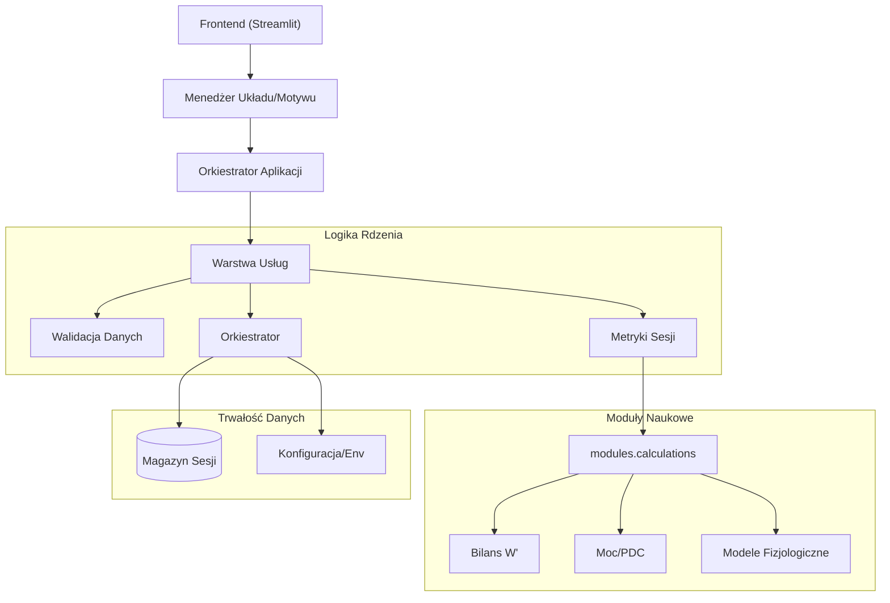

# Tri_Dashboard: Zaawansowana Platforma Analizy Fizjologicznej

## Cel
Tri_Dashboard to specjalistyczna platforma analityczna zaprojektowana dla naukowców sportowych oraz elitarnych trenerów. Wykracza poza standardowe krzywe mocy (PDC), zapewniając głęboki wgląd w:
- **Bilans i Regenerację W' (W' Balance & Reconstitution)**: Modelowanie wyczerpywania i odnowy beztlenowej zdolności do pracy.
- **Oksygenację Mięśni (SmO2)**: Analiza danych NIRS (Moxy/TrainRed) w celu identyfikacji progów fizjologicznych.
- **Kinetykę VO2**: Szacowanie deficytu tlenowego i udziału przemian tlenowych.
- **Odporność na Zmęczenie (Fatigue Resistance)**: Ilościowa ocena wytrzymałości (FRI - Fatigue Resistance Index) oraz dryfu tętna (cardiac drift).

## Przegląd Architektury
Aplikacja wykorzystuje modularną **Architekturę Zorientowaną na Usługi (SOA)** w ramach monolitycznego kodu, oddzielając logikę naukową od warstwy prezentacji.



## Przepływ Danych
1.  **Ingestia**: Pliki (CSV/FIT/TCX przekonwertowane) są ładowane przez `modules.utils.load_data`.
2.  **Walidacja**: `services.data_validation` wymusza integralność schematu, typy danych oraz limity zakresów.
3.  **Przetwarzanie**:
    -   Dane są normalizowane do standardowego schematu (`watts` - moc, `heartrate` - tętno, `smo2`, `time` - czas).
    -   Jeżeli wykryty zostanie szum o wysokiej częstotliwości, następuje resampling.
4.  **Analiza**:
    -   **Metryki**: TSS, NP, IF obliczane według formuł Coggana.
    -   **Modele**: Obliczane są bilans W' (całka), CP (Moc Krytyczna) oraz szacunkowe VO2max.
5.  **Zapis**: Prawidłowe sesje są indeksowane w `data/training_history.db`.

## Instrukcja Instalacji

### Wymagania Wstępne
- Python 3.10 lub nowszy
- Menedżer pakietów `pip`

### Instalacja
1.  Sklonuj repozytorium:
    ```bash
    git clone https://github.com/WielkiKrzych/Tri_Dashboard.git
    cd tri_dashboard
    ```
2.  Zainstaluj zależności:
    ```bash
    pip install -e .[dev]
    ```
3.  Zainicjalizuj bazę danych:
    ```bash
    python init_db.py
    ```

### Konfiguracja
Utwórz plik `.env`, aby nadpisać ustawienia domyślne (opcjonalne):
```ini
APP_TITLE="Analizy Laboratoryjne"
CP_DEFAULT=300
W_PRIME_DEFAULT=20000
DB_NAME="lab_data.db"
```

## Przykłady Użycia

### Uruchomienie Dashboardu
```bash
streamlit run app.py
```
Dostęp do interfejsu pod adresem `http://localhost:8501`.

### Import Masowy
Aby przetworzyć folder z historycznymi plikami CSV:
1.  Umieść pliki w folderze `treningi_csv/`.
2.  Otwórz zakładkę **Analytics > Import** (Analizy > Import).
3.  Kliknij **Import All** (Importuj Wszystkie), aby uruchomić procesor wsadowy.

### Analiza Manualna
Platforma umożliwia analizę porównawczą:
- **Interwały**: Automatyczne wykrywanie odcinków pracy i regeneracji.
- **Desaturacja**: Nachylenie krzywej SmO2 podczas wysiłków o wysokiej intensywności.
- **Rozsprzężenie (Decoupling)**: Dryf efektywności tlenowej (Pa:HR) w długim czasie trwania wysiłku.
