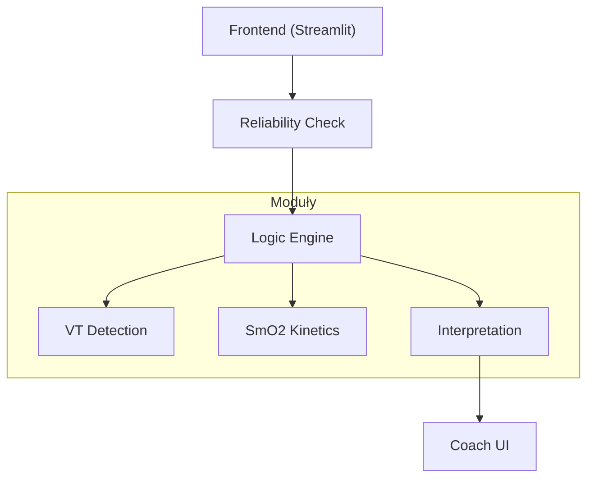

# Tri_Dashboard: Zaawansowana Platforma Analizy Fizjologicznej

## Cel
Tri_Dashboard to specjalistyczna platforma analityczna zaprojektowana dla naukowców sportowych oraz trenerów. Oferuje **probabilistyczne modelowanie fizjologiczne** z naciskiem na surowe dane i przejrzystą interpretację.

## Kluczowe Moduły

### 🫁 Analiza Wentylacyjna (VT)
- Detekcja stref **VT1/VT2** z analizą histerezy ("Ramp Up" vs "Ramp Down").
- **Sensitivity Analysis**: Sprawdza stabilność wyników przy różnych parametrach wygładzania.
- **Reliability Score**: Ostrzeżenia przy niestabilnych wynikach.

### 💪 Analiza SmO2 (NIRS)
- Wyświetla **surowe wartości SmO2** (bez normalizacji).
- **Narzędzia Manualne**: Zaznaczanie interwałów, metryki (Śr. SmO2, Trend Slope), linia trendu.
- **Analiza Kontekstu**: Algorytm wyjaśnia *dlaczego* SmO2 spada (Demand, Occlusion, Delivery Limit).
- **Lag Analysis**: Mierzy opóźnienie reakcji SmO2/HR względem zmiany mocy.

### 🛡️ Reliability Engine
System "Gatekeeper" blokujący analizę przy:
- Błędnym protokole (np. jazda stała zamiast Ramp Test).
- Niskiej jakości sygnału (dropout, szum).

### 🧠 Automated Coach
Silnik interpretacji tłumaczący wyniki na zalecenia treningowe:
- **Diagnoza**: "Aerobic Deficiency", "Slow Recovery Kinetics".
- **Recepta**: "Zone 2 Base Building", "Short-Rest Intervals".

## Architektura



## Instrukcja Instalacji

### Wymagania
- Python 3.10+
- `pip`

### Instalacja
```bash
git clone https://github.com/WielkiKrzych/Tri_Dashboard.git
cd Tri_Dashboard
pip install -e .[dev]
```

### Uruchomienie
```bash
streamlit run app.py
```
Dostęp: `http://localhost:8501`

## Użycie
1. **Wgraj Plik**: `.fit`, `.tcx`, `.csv` (Garmin, Wahoo, TrainRed).
2. **Sprawdź Jakość**: Reliability Score w nagłówku.
3. **Analizuj SmO2/VT**: Zaznacz interwały na wykresie, zobacz Trend Slope.
4. **Przeczytaj Wnioski**: Sekcja "Automated Coach".

## Struktura Katalogów
```
Tri_Dashboard/
├── app.py                 # Główna aplikacja Streamlit
├── modules/
│   ├── calculations/      # Logika naukowa (thresholds, kinetics, quality)
│   └── ui/                # Komponenty UI (vent.py, smo2.py, coach.py)
├── services/              # Warstwa usług (walidacja, orkiestracja)
└── tests/                 # Testy jednostkowe i weryfikacyjne
```
