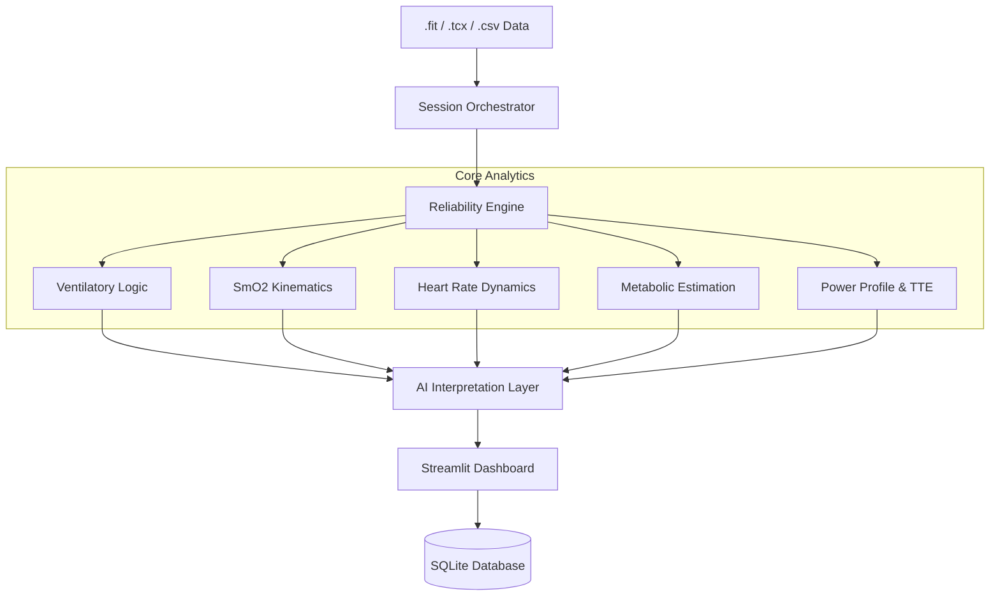

# 🚴‍♂️ Tri_Dashboard: Advanced Physiological Analysis Platform


Tri_Dashboard is a specialized analytical platform designed for sports scientists, coaches, and advanced athletes. It provides **probabilistic physiological modeling** with a focus on raw data transparency, multi-sensor integration, and automated coaching insights.

## 🚀 Key Modules & Features

### 📈 Overview & KPI
- **KPI Dashboard**: Real-time tracking of VO2max (est), Training Load (TSS/IF), and metabolic efficiency.
- **Detailed Reports**: Comprehensive session summaries with automated periodization insights.
- **Summary Tab**: Aggregated view of power, heart rate, SmO2, and ventilation metrics in a single interactive dashboard.

### ⚡ Performance Analytics
- **Power (Moc vs W')**: Real-time W' Balance tracking to identify anaerobic capacity depletion. Automated "Match Burns" detection (efforts below 30% W' Bal).
- **Power Duration Curve (PDC)**: Log-log modeling of your power profile. Includes Critical Power (CP) fitting via `scipy.curve_fit`, PR tracking, and **Phenotype Classification** (e.g., Sprinter, TT Specialist, All-rounder).
- **Intervals**: Specialized analysis of repeating efforts. Includes **Pulse Power** stats and **Gross Efficiency (GE)** modeling to evaluate metabolic cost vs. mechanical output.
- **TTE (Time-to-Exhaustion)**: Advanced analysis of how long you can sustain specific FTP percentages (90-110%). Features a **persistent history** stored in SQLite to track endurance trends over 30/90 days.
- **Biomechanics**: Landing dynamics and efficiency factors derived from wearable sensors, focusing on foot strike and energy return.
- **Drift Maps**: Visualization of physiological decoupling (Efficiency Factor) over time to identify aerobic durability.

### 🫀 Physiology & Thresholds
- **Ventilation (VT1/VT2)**: Automated detection of ventilatory thresholds using V-slope and Ventilatory Equivalent methods. Features **Hysteresis Analysis** for ramp-test reliability.
- **SmO2 (NIRS)**: Support for Moxy and TrainRed. Automated detection of SmO2 LT1/LT2 thresholds based on muscle oxygenation kinetics. Includes **Re-saturation Analysis** to evaluate recovery speed.
- **HRV (DFA a1)**: Estimation of the aerobic threshold (AerT) using heart rate variability dynamics.
- **Thermal Analysis**: Real-time **Heat Strain Index (HSI)** calculation and **Cardiac Drift vs. Core Temperature** modeling to evaluate thermoregulatory cost.

### 🧠 Intelligence & AI
- **Nutrition**: Dynamic modeling of carbohydrate and fat utilization based on intensity and individual metabolic profile.
- **Limiters**: Automated diagnosis of performance bottlenecks (e.g., O2 transport, Muscular utilization, or Anaerobic capacity).
- **AI Coach**: GPT-integrated interpretation layer that provides actionable training advice based on multi-sensor data fusion.

## 🛠 Technical Architecture

The platform is built with a modular service-oriented architecture, ensuring high performance and maintainability.



## 💻 Tech Stack

- **Frontend**: [Streamlit](https://streamlit.io/) for interactive data visualization with dark-mode optimized glassmorphism.
- **Data Processing**: [Polars](https://pola.rs/) & [Pandas](https://pandas.pydata.org/) for high-performance data manipulation.
- **Scientific Computing**: [SciPy](https://scipy.org/), [NumPy](https://numpy.org/).
- **Database**: [SQLite](https://sqlite.org/) for persistent session storage and trend tracking.
- **Visualization**: [Plotly](https://plotly.com/) for interactive, publication-quality charts with unified hover modes.

## ⚙️ Installation & Usage

### Step-by-Step
1. **Clone & Install**:
   ```bash
   git clone https://github.com/WielkiKrzych/Tri_Dashboard.git
   cd Tri_Dashboard
   pip install -e .
   ```

2. **Run the Dashboard**:
   ```bash
   streamlit run app.py
   ```

## 📄 License
This project is licensed under the MIT License.

> [!WARNING]
> **Generated Ramp Test reports are intentionally excluded from version control.**
> They contain analysis artifacts and must not be committed.
>
> **Raw training CSV files are excluded from version control.**
> They contain sensitive source data and must remain local.
