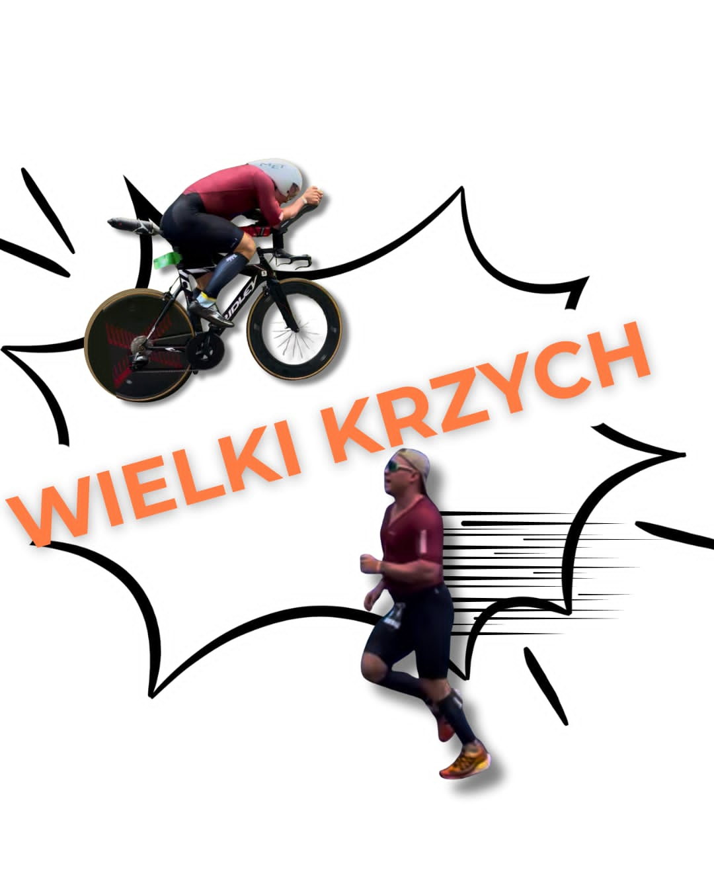

# 🚴 Tri_Dashboard

<div align="center">



[](https://www.python.org/)
[](https://streamlit.io/)
[](LICENSE)
[](tests/)

**Advanced Physiological Analysis Platform for Triathletes**

[Features](#-features) • [Install](#-installation) • [Stack](#-tech-stack) • [Changelog](#-changelog) • [License](#-license)

</div>

---

## 🔬 Overview

Tri_Dashboard to platforma analityczna dla **trenerów**, **naukowców sportu** i **zaawansowanych atletów**. Oferuje:

- 🔬 Wielosensorowa fuzja danych (SmO2, HRV, wentylacja)
- 🤖 AI Coach z diagnozą limitów wydolnościowych
- 📊 Automatyczna detekcja progów (VT1/VT2, LT1/LT2)
- 📈 Generowanie raportów PDF/DOCX z confidence scoring
- ⚡ Wysoka wydajność (Polars, Numba, caching)

---

## ⭐ Features

| Moduł | Funkcjonalność |
|:-------|:---------------|
| **Power** | PDC, CP/W', NP, IF, TSS, phenotype klasyfikacja |
| **Physiology** | SmO2 kinetics (ΔSmO2, Exp-Dmax, 4-knot regression), HRV (DFA α1), termoregulacja, biomechanika |
| **Thresholds** | 4-point CPET: VT1_onset, VT1_steady, RCP_onset, RCP_steady |
| **AI Coach** | Multi-sensor fusion, limiter diagnosis, rekomendacje |
| **Reports** | PDF ~36-stronicowy, DOCX, PNG export, SQLite baza danych, CLI generator |
| **🆕 Wytrzymałość** | Durability Index, sezonowa analiza zmęczenia, rekomendacje treningowe |
| **🆕 Rozkład Treningu** | Time-in-Zone (power/HR/SmO2), balance score, rozkład intensywności |
| **🆕 Heat Strain** | PSI/HSI z korektami środowiskowymi, ocena ryzyka, strategie chłodzenia |
| **🆕 Race Predictor** | Prognoza mocy na zawody (CP/W'), korekty wiatr/temperatura/trasa, pacing |
| **🆕 W' Rekonstytucja** | Mapa wyczerpania/odnowy W', detekcja cykli, tempo regeneracji |

---

## 📂 Project Structure

```
Tri_Dashboard/
├── app.py                  # Main Streamlit app
├── modules/
│   ├── calculations/       # Core algorithms (VT, SmO2, power, HRV...)
│   │   ├── vt_cpet.py              # CPET orchestration + cross-validation
│   │   ├── vt_cpet_preprocessing.py # VE validation, smoothing, artifacts
│   │   ├── vt_cpet_gas_exchange.py  # RER validation + confidence penalty
│   │   ├── vt_cpet_ve_only.py       # Adaptive slope ratio detection
│   │   ├── vt_step.py               # Unbiased variance penalty
│   │   ├── smo2_thresholds.py       # Ramp test T1/T2 + ATT validation
│   │   ├── smo2_breakpoints.py      # 2-segment + Exp-Dmax methods
│   │   ├── smo2_analysis.py         # Feldmann 4-phase + advanced metrics
│   │   ├── metabolic_engine.py      # VO2max CI, VLaMax estimation
│   │   ├── pipeline.py              # Relative SmO2 thresholds + HR consistency
│   │   ├── durability.py            # Durability Index + seasonal analysis
│   │   ├── training_distribution.py # Time-in-Zone (power/HR/SmO2)
│   │   ├── heat_strain.py           # Enhanced PSI with environmental corrections
│   │   ├── race_predictor.py        # Race-day power prediction (CP/W' model)
│   │   ├── w_prime_reconstitution.py # W' depletion/reconstitution cycle analysis
│   │   └── common.py                # VT2 vs Pmax validation
│   ├── ui/                # Streamlit tabs & components
│   │   ├── durability_ui.py         # 🆕 Durability tab
│   │   ├── training_distribution_ui.py # 🆕 Training distribution tab
│   │   ├── heat_strain_ui.py        # 🆕 Heat strain index tab
│   │   ├── race_predictor_ui.py     # 🆕 Race predictor tab
│   │   └── w_prime_reconstitution_ui.py # 🆕 W' reconstitution map tab
│   ├── reporting/         # PDF/DOCX generators
│   │   ├── pdf/layout.py           # KPI dashboard, limiter classification
│   │   ├── pdf/builder.py          # CP vs VT2 validation
│   │   └── figures/smo2_vs_power.py # Artifact filtering
│   ├── frontend/          # Theme, state, layout
│   ├── db/                # SQLite session store
│   ├── ai/                # AI Coach & interval detection
│   └── cache_utils.py     # Caching layer (40+ cached functions)
├── services/              # Data pipeline orchestrator
├── tests/                 # 40+ test files
└── assets/                # Logo, backgrounds
```

---

## ⚡ Performance

| Operation | Speedup |
|:----------|:--------|
| Rolling Mean | 10-50x (Numba) |
| GroupBy | 10-100x (Polars) |
| DataFrame Ops | 10x (vectorized) |
| Column Mapping | 5-10x (O(1) lookup) |
| Caching | TTL-based memoization |

---


## Summary of Fixes Applied

Critical Bug Fixes

- **modules/reports.py**: Fixed variable name typo vt2watts → vt2_watts (lines 309, 335) that caused NameError during report generation

Security Fixes

- **app.py**: Changed unsafe_allow_html=True to False in two locations:
  - Session type badge rendering (line ~132)
  - Alert/badge rendering (line ~359)
  - Prevents potential XSS vulnerabilities

Exception Handling Improvements

- **scripts/generate_pdf_from_csv.py**:
  - Fixed CSV loading to catch specific pd.errors.ParserError instead of bare Exception
  - Added proper error logging before re-raising
  - Fixed all remaining broad exception handlers to log specific warnings instead of silently failing

- **services/data_validation.py**:
  - Added missing logger import
  - Fixed heartrate validation (lines 131-140): replaced bare except Exception: with specific (ValueError, TypeError) handling and added logging
  - Fixed cadence validation (lines 147-156): replaced bare except Exception: with specific (ValueError, TypeError) handling and added logging
  - Removed duplicate return statement

Verification

- All modified modules import successfully
- Data validation functions properly handle both valid and invalid data inputs
- Core utility and validation tests pass

## 📋 Changelog


### 2026-04-06 — Performance Optimization Plan

**Commits on `claude/laughing-goldberg`:**

| # | Commit | Description |
|---|--------|-------------|
| 1 | `d606e49` | **Column aliases centralization** — new `modules/calculations/column_aliases.py` with `normalize_columns()`, `resolve_hr_column()`, `resolve_power_column()`, `resolve_breath_rate_column()`, `resolve_all_aliases()`. 26 tests. Replaced inline `df.columns.str.lower().str.strip()` in 10 UI modules + pipeline.py. |
| 2 | `0b368b1` | **Summary tab cache-first reads** — `modules/ui/summary.py` now reads `st.session_state` cached thresholds (`cpet_vt_result`, `smo2_threshold_result`) before calling expensive detection functions. Falls back to detection if cache empty. |
| 3 | `fc6b925` | **Extract `calculate_cv()` utility** — added to `modules/calculations/common.py`. Replaced inline CV calculations in `repeatability.py` and `threshold_types.py`. Cleaned dead imports. |
| 4 | `62e5282` | **Cached rolling windows** — added `cached_rolling_mean()` and `cached_rolling_median()` with `@st.cache_data` to `modules/cache_utils.py`. Adopted in `summary_thresholds.py`, `hemo.py`, `smo2_manual_thresholds.py`. |
| 5 | `4631846` | **Test coverage** — new `tests/test_pipeline_orchestration.py` (5 tests for `run_ramp_test_pipeline()`) and `tests/test_alert_engine.py` (9 tests for `detect_cardiac_drift()`, `detect_smo2_crash()`, `analyze_session_alerts()`). 40/40 pass. |

### 2026-04-05 — Domain Model, Quality Bands & Threshold Cross-Check

Zgodnie z planem refactoru (4 fazy, wiarygodność analizy > kosmetyka):

| Faza | Artefakt | Co wnosi |
|:-----|:---------|:---------|
| **1** | `docs/DOMAIN_MODEL.md` | Jedno źródło prawdy: kanoniczne entry pointy (`detect_vt_cpet`, `detect_smo2_thresholds_moxy`, `classify_ramp_test`), aliasy kolumn + jednostki, kontrakty rezultatów, kontrakt UI tabs (co wolno / czego nie) |
| **2** | `tests/test_threshold_snapshots.py` | Snapshot testy regresji na deterministycznych rampach z inżynierowanymi break-pointami (VT1 ≈ 235 W, VT2 ≈ 325 W); locks pól wynikowych `detect_vt_cpet`/`detect_smo2_thresholds_moxy`; wymusza `T2_steady=None` dla rampy |
| **3** | `modules/domain/data_quality.py` | Enum `DataQuality` (HIGH/CONDITIONAL/LOW/INVALID @ 0.80/0.60/0.40) + `quality_band()` + `format_band_badge_html()` — ujednolicone bandy zaufania do konsumpcji przez zakładki UI |
| **4** | `modules/domain/threshold_crosscheck.py` | `crosscheck_threshold("VT2", {vent, smo2, hr})` → `AgreementLevel` (STRONG/MODERATE/WEAK/CONFLICT) z delta-watts i pairwise diffs per DOMAIN_MODEL §6; **nie uśrednia cicho** — konflikty są surfaced |

**Zmiany:** +1228 linii (7 nowych plików), zero zmian w runtime logice — czysto addytywne prymitywy. Adopcja przez zakładki UI będzie inkrementalna w kolejnych commitach. 40+ nowych testów pokrywa boundary values, NaN/None handling i kontrakty wiadomości. Bazuje na istniejącym `TransitionZone`/`confidence` modelu — nie duplikuje.

### 2026-04-04 — Runtime Bug Fixes for New Tabs

**5 critical runtime fixes** applied after initial tab deployment:

| Bug | Root Cause | Fix |
|:----|:-----------|:----|
| `NameError: df_resampled` | Wrong variable name in new tab render calls | `df_resampled` → `df_plot_resampled` |
| `NameError: hr_max` | `max_hr` defined too late (inside Physiology section) | Moved to params block + added `hr_rest` |
| `ValueError: displaylogo` | `**CHART_CONFIG` spread into `update_layout()` (it's a plotly config, not layout) | Removed from all 5 new UI files |
| `NameError: duration_min` | Variable only set in "Czas→Moc" branch, referenced in "Moc→Czas" | Initialize `duration_min`, `target_power`, `pred` before mode branches |
| `KeyError: time_min` | Nutrition tab received `df_plot` (no `time_min` column) | Changed to `df_plot_resampled` |
| `StreamlitMixedNumericTypesError` | `min(cp_input, 500.0)` returned float, other params were int | `min(int(cp_input), 500)` keeps all int |

### 2026-04-04 — 5 New Performance Tabs: Durability, TSD, Heat Strain, Race Predictor, W' Reconstitution

**5 new evidence-based tabs added to the Performance and Physiology sections.** Each tab features interactive charts, training recommendations, and comprehensive theory sections citing 8-10 post-2020 peer-reviewed publications.

**New Tabs (5):**

| Tab | Section | Files | Key Features |
|:----|:--------|:------|:-------------|
| **🛡️ Wytrzymałość** | ⚡ Performance | `durability.py`, `durability_ui.py` | Durability Index (first/second half power ratio), seasonal analysis (sliding windows), training recommendations based on DI thresholds |
| **📊 Rozkład Treningu** | ⚡ Performance | `training_distribution.py`, `training_distribution_ui.py` | Time-in-Zone for power/HR/SmO2, intensity distribution (easy/moderate/hard %), zone balance score, multi-modality pie charts |
| **🌡️ Heat Strain** | ⚡ Performance | `heat_strain.py`, `heat_strain_ui.py` | Enhanced PSI with environmental corrections (wind, temp, elevation), risk categorization, heat dissipation modeling, cooling strategy recommendations |
| **🏁 Race Predictor** | ⚡ Performance | `race_predictor.py`, `race_predictor_ui.py` | CP/W' race prediction with environmental adjustments, Time→Power and Power→Time modes, predictions table for 12 common distances, pacing strategies |
| **🔋 W' Rekonstytucja** | 🫀 Physiology | `w_prime_reconstitution.py`, `w_prime_reconstitution_ui.py` | W' balance timeline, depletion cycle detection, recovery rate analysis, bi-exponential model (Caen 2021), cycle map visualization |

**Code Quality:**
- All charts use `CHART_CONFIG` via `chart()` shared helper
- All calculations exported through `modules/calculations/__init__.py`
- TabRegistry pattern (OCP) — lazy-loaded, no app.py import bloat
- Smoke tests pass for all 5 new modules
- 40+ post-2020 peer-reviewed references across theory sections

### 2026-04-04 — Evidence-Based Theory Expansion Across Performance Tabs

**Complete audit and expansion of all Performance tab theory sections with post-2020 peer-reviewed literature.** Every tab now features comprehensive `📖 Teoria i Fizjologia` expanders with definition, interpretation tables, physiological mechanisms, practical tips, and bibliography.

**Code Removal (2 items):**
| Change | File | Description |
|:-------|:-----|:------------|
| Remove Planer Treningowy | `modules/training_plan/`, `app.py` | Deleted 5 files + UI module — unused feature removed completely |
| Remove auto interval detection | `modules/ui/intervals_ui.py` | Removed automatic interval detection UI and logic |
| Remove TTE history toggle | `modules/ui/tte_ui.py` | Removed "Zalicz trening do historii TTE" toggle and save logic |

**Theory Expansions (7 tabs):**

| Tab | File | Content | References |
|:----|:-----|:--------|:-----------|
| **Intervals: Pulse Power** | `modules/ui/intervals_ui.py` | PP = SV × a-vO₂ diff × GE, 4-level CV drift table, fatigue detection research | Nuuttila 2024, Barsumyan 2025 |
| **Intervals: Gross Efficiency** | `modules/ui/intervals_ui.py` | GE definition + Keytel formula, 6-level table, 4 determinant factors, fatigue mechanisms | Kamba 2023, Gejl 2024, Fares 2025 |
| **Biomech: Moment vs Oxidation** | `modules/ui/biomech.py` | IMP mechanism, 4-phase deoxygenation, cadence effect on IMP, reoxygenation kinetics | Yogev 2023, Feldmann 2022, Kilgas 2022 |
| **Biomech: Occlusion Risk Map** | `modules/ui/biomech.py` | 4-level SmO2 threshold table, risk zone interpretation, BFR torque research | Arnold 2024, Sendra-Pérez 2024 |
| **Model: CP/W'** | `modules/ui/model.py` | CP physiological meaning, 9-level interpretation, bi-exponential W' reconstitution | Goulding & Marwood 2023, Chorley 2022 |
| **Hematology: THb + SmO2** | `modules/ui/hemo.py` | 4-quadrant hemodynamic map, vasodilation/occlusion/pooling/recovery mechanisms | Cherouveim 2023, Dennis 2021 |
| **Drift Maps** | `modules/ui/drift_maps_ui.py` | CV drift definition, 4-level HR drift table, 4 physiological mechanisms | Souissi 2021, Barsumyan 2025 |
| **TTE** | `modules/ui/tte_ui.py` | 5-level TTE table, 4 limiting mechanisms, training impact table, race applications | Wilber 2022, Klimstra 2024 |

**Chart Interactivity (5 tabs):**
| Tab | Fix |
|:----|:----|
| **Model** | Added `config=CHART_CONFIG`, enhanced hovertemplate to show power + time |
| **Hematology** | Added `config=CHART_CONFIG` to both Hemo-Scatter and Trend charts |
| **Drift Maps** | Added `config=CHART_CONFIG` to all 4 charts (Power vs HR, Power vs SmO₂, 2× Drift trend) |
| **TTE** | Added `config=CHART_CONFIG` to power distribution chart |

**Total: 45+ peer-reviewed references (all post-2020) integrated across 8 theory sections.**

### 2026-04-02 — Evidence-Based SmO2 Threshold Detection Overhaul

**Scientific basis:** Perrey, Ferrari et al. (2024) Sports Medicine systematic review (191 studies), Sendra-Pérez et al. (2023, 2024), Feldmann et al. (2022), Racinais et al. (2014).

**CRITICAL — Threshold Detection Accuracy (3):**
| Change | Reference | Description |
|:-------|:----------|:------------|
| ΔSmO2 baseline correction | Sendra-Pérez 2024 | Normalizes SmO2 relative to warm-up baseline, eliminates inter-individual differences |
| Signal inversion for Exp-Dmax | Sendra-Pérez 2024 | Inverted ΔSmO2 behaves like lactate (increasing) — correct Exp-Dmax application |
| First 60s exclusion | Feldmann 2022 | Abrupt test starts cause NIRS artifacts; excluded from breakpoint analysis |

**HIGH — Analysis Quality (3):**
| Change | Reference | Description |
|:-------|:----------|:------------|
| SmO2min → VO2peak estimation | Feldmann 2022 (R²=0.85) | Non-invasive fitness proxy: VO2max ≈ 88.2 − 0.62 × SmO2min |
| BP2 inflection type detection | Feldmann 2022 | Classifies T2 as positive (plateau) or negative (further desaturation) |
| 4-knot segmented regression | Feldmann 2022 | Cross-validation of T1/T2 via 3-segment piecewise regression |

**MEDIUM — New Capabilities (2):**
| Change | Reference | Description |
|:-------|:----------|:------------|
| Butterworth low-pass filter | Sendra-Pérez 2024 | 3rd smoothing option (median / Savgol / Butterworth 0.2 Hz) |
| Multi-muscle MOT2 consistency | Sendra-Pérez 2024 | Utility for comparing MOT2 across multiple muscle sensors (ICC≈0.64) |

### 2026-04-02 — Architecture Improvements & Codebase Cleanup

**Architecture (5 improvements):**
| Change | Files | Description |
|:-------|:------|:------------|
| Config grouped dataclasses | `config.py` | 7 frozen dataclasses replace flat namespace, 47 passthrough attributes preserved |
| BaseStore unified DB | `db/base.py`, 3 stores | New BaseStore ABC, ~100 lines boilerplate removed |
| State key registry | `frontend/state.py` | 34 keys in `_defaults` dict, 11 guard clauses removed |
| UI shared components | `ui/shared.py` | chart(), metric(), require_data(), dataframe(), alert() — 8+2 replacements |
| Typed SessionPipeline | `services/session_pipeline.py` | Typed dataclasses for analysis pipeline (purely additive) |

**Codebase Cleanup:**
- 14 orphaned files deleted (removed tabs, dead plugins, legacy scripts)
- 11 unused imports removed from 10 files
- 19 dead functions removed from 9 files
- `style-light.css` deleted (dark-mode only)
- Tests updated for removed references

**UI Changes:**
- Dark mode forced (theme toggle removed)
- 6 tabs removed: Longitudinal Trends, Niezawodność, Benchmarking, Porównanie Sesji, Multi-Sport
- Athlete profile selector removed from sidebar
- App title changed to "Tri Dashboard"

### 2026-04-01 — UX Fixes, Tech Debt Cleanup & Dead Code Removal

**UX/Runtime (2 fixes):**
- SQLite schema migration — legacy DBs auto-migrated on startup (idempotent, no data loss)
- Streamlit deprecation warnings removed — 84 occurrences of `use_container_width=True` replaced with `width="stretch"`

**Dead Code Removal:**
- `modules/ui/sidebar.py` removed (zero imports)
- ~880 lines of dead code removed across 21 files (unused functions, orphaned imports, dead plugins)
- `modules/ui/registry.py` and `modules/ui/vent_thresholds_report.py` deleted

### 2026-03-29 — PDF Report Fixes & Data Analysis v3.3

**PDF Layout (6 fixes):**
- Thresholds table column width 42→52mm (text overflow fix)
- VO2max altitude table: fixed nested data path (`canonical_physiology.vo2max`) — was showing "---"
- Torque outlier filtering: cadence ≥60rpm guard removes post-exhaustion artifacts (65→149Nm → 12→35Nm)
- `PageBreak` before "KLUCZOWE LICZBY" heading (page 21 orphan fix)
- `PageBreak` before "POŁĄCZENIE Z DRYFEM HR I EF" heading (page 27 orphan fix)
- Copyright © Krzysztof Kubicz footer on every page + end section

**App Fixes (4 fixes):**
- Manual Thresholds tab: KeyError on V-Slope plot resolved (dynamic column mapping for VE/slope)
- CP model now fitted from MMP curve when CPET data unavailable (3-point power-duration fallback)
- VT spike skip logic: limited to first 2 stages only — improves VT2 detection accuracy
- Scroll zoom on all Plotly charts disabled globally (`scrollZoom: false`)

### 2026-03-28 — Chart & Visualization Overhaul v1.0

- Main timeline chart replaced with 2-row subplots (Power+HR / SmO2+VE) — 4 overlapping axes eliminated
- Training zone bands Z1–Z6 as background `hrect` on power panel
- CP/VT1/VT2 `hline` annotations on power panel
- Range slider on x-axis for session navigation
- FRI gauge axis `[0.6, 1.0]` → `[0, 1.0]` + critical zone `<0.60`
- SmO2 color unified to `Config.COLOR_SMO2` across all charts
- W' Balance hover: value in J + % of W' reserve
- Radar: elite reference ring + % tick labels on radial axis
- `CHART_CONFIG` (logo off, hover modebar, scroll zoom, retina export) applied to all 20+ chart calls
- `CHART_HEIGHT_*` constants replace hardcoded px values in 7 files
- `_get_smooth()` helper eliminates double rolling-mean on pre-smoothed columns

### 2026-03-26 — PDF Report v3.2: New Sections & Microcycle Periodization

4 new PDF report pages, expanded training recommendations, CLI PDF generator.

| Category | Change | Reference |
|:---------|:-------|:----------|
| **NEW** | HRV/DFA Alpha-1 page: zone classification, RMSSD/SDNN | Mateo-March 2024, Iannetta 2024 |
| **NEW** | Skin Temperature Gradient page: core-skin ΔT | Périard 2021, Racinais 2019 |
| **NEW** | Altitude Adjustment page: VO₂max sea-level equivalent | Wehrlin & Hallen 2006 |
| **NEW** | Microcycle Periodization page: weekly schedule with TSS | Auto-generated |
| **NEW** | CLI PDF generator: headless PDF generation | — |
| **IMPROVED** | 5 diverse training recommendations per classification | 6 calc modules |

### 2026-03-25 — PDF Report Quality Audit v3.1

Comprehensive audit from exercise physiology professor perspective.
**8 critical fixes, 6 new analysis sections, 16+ cited publications.**

| Category | Change | Reference |
|:---------|:-------|:----------|
| **FIX** | Deduplicated cardiac drift blocks | — |
| **FIX** | Reconciled contradictory limiter diagnoses | Multi-method hierarchy |
| **FIX** | SmO₂ drift -26% mislabeled as "STABILNY" | Threshold recalibration |
| **FIX** | Cardiac Drift value not propagating to verdict page | Key mapping fix |
| **FIX** | Confidence score visual flagging (<50% = warning) | — |
| **FIX** | Unified hydration recommendations (500-750ml/h) | — |
| **FIX** | Unified version strings (RAMP_METHOD_VERSION) | version.py SSoT |
| **FIX** | Clarified Upper Aerobic zone as separate model | — |
| **NEW** | Tidal Volume decomposition (VE = TV × RR) | — |
| **NEW** | Ventilatory Reserve (Breathing Reserve %) | MVV estimation |
| **NEW** | W' Reconstitution table (30s→20min recovery) | Caen et al. 2021 |
| **NEW** | HR Recovery Kinetics classification | Buchheit 2014 |
| **NEW** | Cadence context in occlusion analysis | Hammer et al. 2021 |
| **NEW** | 5 diverse training sessions per metabolic block | — |

### 2026-03-21 — Evidence-Based Physiology Overhaul v3.0

Complete audit based on **42 peer-reviewed publications (2021-2026)**.

**CRITICAL — New Models (5):**
| Change | Reference | Description |
|:-------|:----------|:------------|
| VO2max: Jurov 2023 sex-specific | Life (MDPI) 13(1):160 | M: `0.10×PO - 0.60×BW + 64.21`, F: `0.13×PO - 0.83×BW + 64.02` |
| VLaMax: Wackerhage 2025 disclaimer | Sports Med 55:1853-1866 | No validated glycolytic equivalent to VO2max |
| W' Balance: Caen 2021 bi-exponential | EJAP | Two-phase tau (fast PCr + slow metabolic) |
| VT confidence intervals | Gronwald 2024 meta-analysis | VT1/VT2 as ranges (±5-20W) |
| VT vs LT terminology | Cerezuela-Espejo 2023 | VT1 ≠ LT1 — different mechanisms |

**HIGH — Updated Models (12):** DFA α1 window 600s, PSI → aPSI adaptive, RER validation, VO2max zone floor 110% CP, cardiac drift analysis, SmO2 T1 cross-validation, altitude VO2max correction, strict data validation, cross-signal validation, temporal bounds, DB athlete_id, composite recovery score

**MEDIUM — New Features (4):** Pacing analysis, SmO2 context interpretation, contextual limiter recommendations, phenotype disclaimer

### 2026-03-17 — Exercise Physiology Audit

9 physiological fixes + 4 code quality fixes. See commit `6e1f4d8` for details.

### 2026-03-16 — Security & Code Quality Audit

**5 critical, 10 high, 7 medium issues.**

**CRITICAL (5):** Missing logger crash fix, dead duplicate code removal, wrong `np.interp` argument order, orphaned code in cache_utils, duplicate subprocess.run

**HIGH (10):** XSS fixes, information disclosure prevention, DataFrame mutation fixes (6 files), dead code removal, redundant imports, silent exception logging

**MEDIUM (7):** User note XSS, Plotly hover injection, filename sanitization, CSS path traversal, relative .git path, magic number extraction, requirements lock warning

### 2026-03-01 — PDF Polish & VO2max/VLaMax Fixes

- PNG export available immediately after CSV upload
- Professional PDF report polish for commercial quality
- VO2max and VLaMax calculations corrected per exercise physiology

### 2026-02-28 - Ramp Report Review Fixes

**CRITICAL (4):**
- [C-01] SmO2 Drift status - `abs()` for negative values + 3-level thresholds
- [C-02] Exp-Dmax method for T2 detection - ICC=0.79-0.91
- [C-03] CP vs VT2 validation - warning when CP > VT2 by >2%
- [C-04] HR consistency fix - linear interpolation

**HIGH (3):**
- [H-01] VO2max confidence interval - ±ml/kg/min + absolute value (L/min)
- [H-02] VLaMax marked as estimated - ±15-20% error range
- [H-03] Thermal + cardiac drift integration

**MEDIUM (4):**
- [M-01] SmO2 chart artifact filtering - >10% deviation removal
- [M-02] Z4 Threshold range widened - 106-120% of VT1
- [M-03] Reoxy half-time reference ranges - <15s/15-30s/>30s
- [M-04] BR column in VT thresholds table

**NARRATIVE (2):**
- [N-02] Tempo zone description fix
- [N-03] Milder language for low confidence

### 2026-02-28 - SmO2 Threshold Analysis v2.1

**HIGH (3):**
- Double-linear (2-segment) regression
- Exp-Dmax method for T2
- MOT1 reliability warning - 3 consecutive steps

**MEDIUM (4):**
- Adaptive curvature thresholds (percentile-based)
- ATT (adipose tissue) validation
- Feldmann 4-phase model
- Savitzky-Golay filter option

**LOW (2):**
- Confidence rescaled 0.6→0.8
- Adaptive filter window

### 2026-02-27 - VT Detection Protocol v2.0

**CRITICAL (3):**
- RER validation with confidence penalty
- VT2 vs Pmax sanity check
- Pmax-relative fallback formula

**WARNING (5):**
- VE unit validation (5-250 L/min)
- IQR-based artifact filtering
- Adaptive slope ratio threshold
- Cross-validation between methods
- Relative SmO2 modulation thresholds

**MINOR (2):**
- Unbiased variance penalty
- Edge effects fix in smoothing

---

## 📄 License

MIT License - zobacz [LICENSE](LICENSE) file.

---

## ⚠️ Disclaimer

> **To oprogramowanie służy wyłącznie celom edukacyjnym i treningowym.** Nie jest urządzeniem medycznym i nie może być używane do diagnozowania lub leczenia schorzeń. Zawsze konsultuj się z wykwalifikowanymi specjalistami.

---

<div align="center">

⭐ Star na GitHubie | 🍴 Fork | 👁️ Watch

</div>
# Summary of Fixes Applied

## Critical Bug Fixes
- **modules/reports.py**: Fixed variable name typo `vt2watts` → `vt2_watts` (lines 309, 335) that caused NameError during report generation

## Security Fixes  
- **app.py**: Changed `unsafe_allow_html=True` to `False` in two locations:
  - Session type badge rendering (line ~132)
  - Alert/badge rendering (line ~359)
  - Prevents potential XSS vulnerabilities

## Exception Handling Improvements
- **scripts/generate_pdf_from_csv.py**:
  - Fixed CSV loading to catch specific `pd.errors.ParserError` instead of bare `Exception`
  - Added proper error logging before re-raising
  - Fixed all remaining broad exception handlers to log specific warnings instead of silently failing
  
- **services/data_validation.py**:
  - Added missing logger import
  - Fixed heartrate validation (lines 131-140): replaced bare `except Exception:` with specific `(ValueError, TypeError)` handling and added logging
  - Fixed cadence validation (lines 147-156): replaced bare `except Exception:` with specific `(ValueError, TypeError)` handling and added logging
  - Removed duplicate return statement

## Verification
- All modified modules import successfully
- Data validation functions properly handle both valid and invalid data inputs
- Core utility and validation tests pass
