# 🚴‍♂️ Tri_Dashboard: Advanced Physiological Analysis Platform


Tri_Dashboard is a specialized analytical platform designed for sports scientists, coaches, and advanced athletes. It provides **probabilistic physiological modeling** with a focus on raw data transparency, multi-sensor integration (SmO2, VO2 Master, HRV), and automated coaching insights.

## 🚀 Key Modules & Features

### 📄 Ramp Test Analytics & Reporting
A fully automated pipeline for analyzing metabolic ramp tests.
- **Advanced Automated Threshold Detection**:
    - **4-Point Ventilatory Model (CPET Method)**:
        - **VT1_onset** (Gas Exchange Threshold)
        - **VT1_steady** (Steady-State Aerobic Ceiling)
        - **RCP_onset** (Respiratory Compensation Point / VT2)
        - **RCP_steady** (Severe Domain Entry)
    - **Physiological SmO2 Kinetics**:
        - **SmO2_T1** (LT1 analog): Trend-based detection with CV < 4%.
        - **SmO2_T2_onset** (RCP analog): Maximum global curvature and oscillation amplitude analysis (↑30%).
        - **Strict Ramp Logic**: Explicit exclusion of SmO2_T2_steady (physiologically invalid for ramps) and removal of the final "ischemic crash" step.
- **Pro-Level Reporting**: Generates professional **PDF** and editable **DOCX** reports.
    - **Confidence Scoring**: 0-100% reliability score based on signal quality and cross-sensor validation.
    - **4-Domain Zones**: Stable Aerobic, Progressive Extraction, Non-Steady Severe, and Ischemic Collapse.
    - **Educational Content**: "Why it matters" blocks explaining metrics to athletes.
    - **Advanced Metrics**: Biomechanics (Torque vs Cadence), Metabolic Model (VO2max/VLaMax balance), Cardiac Drift Heatmaps, and Thermal Efficiency.
    - **Table of Contents** with synchronized page numbering.
- **PDF Summary Export**: Multi-page PDF report from the Summary tab with:
    - **7 Pages**: Title, Training Overview, Ventilation (VE/BR), CP Model, SmO2/THb, VT1/VT2 Thresholds, LT1/LT2 Thresholds, VO2max Estimation.
    - **Matplotlib Charts**: High-quality static charts for all key metrics.
    - **Polish Language Support**: Full UTF-8 support with DejaVuSans font.
    - **Statistics Tables**: Min/Max/Avg for all physiological parameters.
- **Ramp Archive**: Store and compare historical test results.

### ⚡ Performance Analytics
- **Power Duration Curve (PDC)**: Log-log modeling of your power profile. Includes **Critical Power (CP)** fitting, W' (Anaerobic Work Capacity), and **Phenotype Classification** (e.g., Sprinter, TT Specialist).
- **Advanced Metrics**:
    - **Time-to-Exhaustion (TTE)**: Estimations for 90-110% FTP with historical trend tracking.
    - **Durability Index**: How your power degrades over time (Stamina analysis).
    - **W' Balance**: Real-time W' reconstitution tracking.
    - **VO2max Estimation**: Sitko et al. 2021 formula with 95% confidence intervals based on 5-minute max power.
- **Intervals Generator**: Convert structured workout JSONs (ZwoFactory/Intervals.icu) into universally compatible CSVs for TrainingPeaks/Garmin.
- **Training Load**: TSS/CTL/ATL tracking and form estimation.
- **Summary Dashboard**: Consolidated view with all key charts and metrics in one place:
    - Training timeline with Power, HR, SmO2, and VE overlay
    - Ventilation (VE/BR) analysis with statistics
    - CP Model mathematical visualization
    - SmO2 vs THb time series
    - VT1/VT2 and LT1/LT2 threshold displays with full physiological context

### 🫀 Physiology & Biometrics
- **SmO2 (NIRS)**: Deep dive into muscle oxygenation.
    - **Re-saturation Analysis** and "Muscle Oxygen Kinetics" modeling.
    - **THb Analysis** (Total Hemoglobin) when data is available.
    - **Correlation Analysis** (SmO2 vs Power scatter plots).
    - **SmO2 Threshold Detection**: Automatic LT1/LT2 detection using advanced kinetics analysis.
- **Ventilatory Analysis**:
    - **VE/BR Dynamics**: Ventilation and breathing rate analysis with Tidal Volume (TV) calculations.
    - **VT1/VT2 Detection**: Automated ventilatory threshold detection using V-slope and VE/VO2 methods.
    - **Manual Threshold Editing**: Interactive adjustment of thresholds with real-time visualization.
- **HRV (DFA α1)**: Estimation of aerobic threshold (AerT) using heart rate variability dynamics with dynamic windowing.
- **Thermal Analysis**:
    - **Heat Strain Index (HSI)**: Cumulative heat load tracking.
    - **Efficiency Drop**: Correlation between core temperature rise and efficiency loss (Cardiac Drift).
    - **Heat Adaptation Score**: VLaMax thermal sensitivity.
- **Biomechanics**: Analysis of Cadence vs Torque relationships to identify mechanical limiters.
- **Cardiac Drift Maps**: Heatmap visualization of HR drift over time and power zones.
- **Flexible Data Handling**: Graceful handling of missing sensors - each analysis tab works independently based on available data columns.

### 🧠 Intelligence & AI
- **Limiters**: Automated diagnosis of performance bottlenecks (O2 transport vs. Utilization, ventilatory vs. metabolic).
- **AI Coach**: GPT-integrated interpretation layer providing actionable advice based on multi-sensor data fusion.
- **Executive Summary**: Auto-generated comprehensive analysis with phenotype classification.

### 🗂️ Data Management
- **Session Orchestrator**: Automated data pipeline with quality validation.
- **Multi-format Support**: FIT, TCX, CSV files from Garmin, TrainingPeaks, Intervals.icu.
- **TrainRed/Moxy Integration**: Automatic detection and merging of NIRS sensor data.
- **Session History**: SQLite-based persistent storage with trend analysis.

### ⚡ Performance Optimizations
- **Two-Phase Grid Search**: SmO2 breakpoint detection optimized from O(n²) to O(n²/400) for **10x speedup**.
- **Dynamic Programming**: Step detection algorithm with improved constant factors for **2-5x speedup**.
- **Vectorized Operations**: Pandas iterrows replaced with vectorized operations for **10x speedup**.
- **Database Batch Fetch**: Optimized SQLite queries with custom row factories for **5x speedup**.
- **Cached Column Normalization**: O(1) lookup for column name mapping with **5-10x speedup**.
- **Chunked Processing**: Automatic chunking for large files (>100k rows) to prevent OOM errors.
- **Async I/O**: Non-blocking file operations and computations using ThreadPoolExecutor.
- **Result Caching**: Automatic caching of expensive computations with TTL support.
- **Polars Integration**: Optional Polars backend for 10-100x speedup on large datasets.
- **Numba JIT**: JIT-compiled numerical functions for 10-100x speedup on mathematical operations.
- **Background Tasks**: Thread pool for running heavy computations without blocking UI.
- **Performance Monitoring**: Built-in timing, memory tracking, and metrics collection.

## 🛠 Technical Architecture

The platform uses a modular, service-oriented architecture:

```
Tri_Dashboard/
├── app.py                    # Main Streamlit application
├── modules/
│   ├── calculations/         # Core physics and physiology algorithms
│   │   ├── ventilatory.py    # VT1/VT2 detection (V-slope, VE/VO2)
│   │   ├── thresholds.py     # Step test analysis pipeline
│   │   ├── smo2_advanced.py  # SmO2 kinetics and slope detection
│   │   ├── smo2_breakpoints.py   # Optimized breakpoint detection
│   │   ├── step_detection.py     # Optimized step detection
│   │   ├── hrv.py            # DFA α1 calculation
│   │   ├── cardiac_drift.py  # Cardiac drift analysis
│   │   ├── thermal.py        # Thermoregulation models
│   │   ├── metabolic_engine.py # VLaMax/VO2max modeling
│   │   ├── power.py          # PDC, CP, W' calculations
│   │   ├── kinetics.py       # VO2/SmO2 on-kinetics
│   │   ├── metrics.py        # Training metrics calculations
│   │   └── quality.py        # Signal quality validation
│   ├── reporting/            # PDF/DOCX builders and figure generation
│   │   ├── pdf/              # Premium PDF generator with TOC
│   │   │   ├── summary_pdf.py    # Summary tab PDF export
│   │   │   ├── styles.py         # PDF styling and fonts
│   │   │   └── layout.py         # PDF layout engine
│   │   ├── figures/          # Chart generators (biomech, drift, thermal)
│   │   └── docx_builder.py   # Word document generation
│   ├── ui/                   # Streamlit tab components
│   │   ├── summary.py            # Consolidated summary dashboard
│   │   ├── vent.py               # Ventilation analysis UI
│   │   ├── vent_thresholds.py    # Ventilatory threshold detection UI
│   │   ├── manual_thresholds.py  # Manual VT1/VT2 editing
│   │   ├── smo2.py               # SmO2 analysis UI
│   │   ├── smo2_thresholds.py    # SmO2 threshold detection UI
│   │   ├── smo2_manual_thresholds.py  # Manual LT1/LT2 editing
│   │   ├── power.py              # PDC and power profile UI
│   │   ├── hrv.py                # HRV analysis UI
│   │   ├── thermal.py            # Thermal analysis UI
│   │   ├── hemo.py               # Hemodynamic analysis
│   │   └── base.py               # UI plugin base classes
│   ├── performance/          # Performance optimization modules
│   │   ├── async_utils.py        # Async I/O operations
│   │   ├── cache_utils.py        # Result caching with TTL
│   │   ├── polars_adapter.py     # Polars DataFrame acceleration
│   │   ├── numba_utils.py        # JIT-compiled functions
│   │   ├── task_queue.py         # Background task manager
│   │   └── monitoring.py         # Performance metrics
│   └── frontend/             # Theme, state, and layout management
│       ├── theme.py          # UI theming
│       ├── state.py          # Session state management
│       ├── layout.py         # App layout components
│       └── components.py     # Reusable UI components
├── services/                 # Data processing and orchestration
│   └── session_analysis.py   # Session analysis service
├── models/                   # Data models
│   └── results.py            # Analysis result models
└── tests/                    # Comprehensive test suite
```



```mermaid
graph TD
    Data[".fit / .tcx / .csv Data"] --> Orchestrator["Session Orchestrator"]
    Orchestrator --> Quality["Reliability Engine"]
    
    subgraph "Core Analytics"
        Quality --> VT["Ventilatory Logic"]
        Quality --> NIRS["SmO2 Kinematics"]
        Quality --> PDC["CP / Power Profile"]
        Quality --> Thermal["Heat Strain Model"]
        Quality --> HRV["DFA α1 Analysis"]
    end
    
    VT & NIRS & PDC & Thermal & HRV --> Model["Physiological Model"]
    Model --> Report["PDF/DOCX Generator"]
    Model --> UI["Streamlit Dashboard"]
    Model --> Archive["Session History DB"]
```

## 💻 Tech Stack

| Category | Technologies |
|----------|-------------|
| **Frontend** | [Streamlit](https://streamlit.io/) for interactive data visualization |
| **Data Processing** | [Polars](https://pola.rs/) & [Pandas](https://pandas.pydata.org/) for high-performance data manipulation |
| **Analysis** | [SciPy](https://scipy.org/) (curve fitting), [NumPy](https://numpy.org/), [Statsmodels](https://www.statsmodels.org/) |
| **HRV Analysis** | [NeuroKit2](https://neuropsychology.github.io/NeuroKit/) for DFA α1 calculations |
| **Acceleration** | [Numba](https://numba.pydata.org/) for JIT-compiled performance, [MLX](https://github.com/ml-explore/mlx) for Apple Silicon |
| **Reporting** | [ReportLab](https://pypi.org/project/reportlab/) (PDF), [python-docx](https://python-docx.readthedocs.io/) (Word) |
| **Visualization** | [Matplotlib](https://matplotlib.org/) (static reports), [Plotly](https://plotly.com/) (interactive UI) |
| **Testing** | [Pytest](https://pytest.org/) with timeout support |
| **VO2max Model** | Sitko et al. 2021 formula: VO2max = 16.61 + 8.87 × (MMP5 / weight) |
| **Async I/O** | [Asyncio](https://docs.python.org/3/library/asyncio.html) for non-blocking operations |
| **Caching** | [DiskCache](http://www.grantjenks.com/docs/diskcache/) for result memoization |
| **JIT Compilation** | [Numba](http://numba.pydata.org/) for machine code acceleration |
| **Monitoring** | Custom performance metrics and memory tracking |

## ⚙️ Installation & Usage

### 1. Clone & Install
```bash
git clone https://github.com/WielkiKrzych/Tri_Dashboard.git
cd Tri_Dashboard
pip install -r requirements.txt
```

### 2. Run the Dashboard
```bash
streamlit run app.py
```

### 3. Optional: Run Tests
```bash
pytest
```

## 📊 Dashboard Overview

The dashboard is organized into four main sections:

| Tab | Description |
|-----|-------------|
| **📊 Overview** | Report generation, KPI dashboard, **Summary** (consolidated charts), DOCX/PNG/PDF export |
| **⚡ Performance** | Power analysis, PDC, Training Load, TTE, Intervals Generator |
| **🧠 Intelligence** | Nutrition analysis, Limiters diagnosis, AI Coach |
| **🫀 Physiology** | HRV, SmO2 (with thresholds), Ventilation (VE/BR), Ventilatory Thresholds (VT1/VT2), Thermal, Biomechanics, Ramp Archive |

### Summary Tab Features
The **Summary** tab provides a consolidated view of all key training metrics:
1. **Training Timeline**: Multi-axis chart showing Power, HR, SmO2, and VE
2. **Ventilation Analysis**: VE and BR with Min/Max/Avg statistics
3. **CP Model**: Mathematical power-duration curve visualization
4. **SmO2/THb**: Muscle oxygenation and total hemoglobin trends with statistics
5. **Ventilatory Thresholds**: VT1/VT2 with HR, VE, BR, and TV values
6. **SmO2 Thresholds**: LT1/LT2 with HR and SmO2 context
7. **VO2max Estimation**: With 95% confidence intervals

**PDF Export**: One-click generation of professional multi-page PDF reports from the Summary tab, perfect for sharing with coaches or athletes.

## 🔧 Performance Features

### Async Operations
Run heavy computations without blocking the UI:
```python
from modules.async_utils import load_data_async

df = await load_data_async(file)
```

### Result Caching
Automatic caching of expensive computations:
```python
from modules.cache_utils import cache_result

@cache_result(ttl=3600)
def expensive_calculation(data):
    return heavy_computation(data)
```

### Polars Acceleration
10-100x faster operations on large datasets:
```python
from modules.polars_adapter import fast_groupby_agg

result = fast_groupby_agg(df, 'category', {'value': 'mean'})
```

### Numba JIT
JIT-compiled numerical functions:
```python
from modules.numba_utils import fast_rolling_mean

smoothed = fast_rolling_mean(arr, window=10)
```

### Background Tasks
Run computations in background threads:
```python
from modules.task_queue import submit_background_task

task_id = submit_background_task("Analyze", analyze_function, data)
```

### Performance Monitoring
Track execution times and memory usage:
```python
from modules.monitoring import timed, generate_performance_report

@timed
def my_function():
    pass

print(generate_performance_report())
```

## 📊 Performance Benchmarks

| Operation | Before | After | Speedup |
|-----------|--------|-------|---------|
| SmO2 Breakpoint Detection | O(n²) | O(n²/400) | **10x** |
| Step Detection | O(n²) | O(n²) optimized | **2-5x** |
| DataFrame Iteration | iterrows | vectorized | **10x** |
| DB Queries | row-by-row | batch fetch | **5x** |
| Column Normalization | O(n×k) | O(n) | **5-10x** |
| Rolling Mean (Numba) | Pandas | JIT compiled | **10-50x** |
| GroupBy (Polars) | Pandas | Polars | **10-100x** |

## 📄 License
This project is licensed under the MIT License.

---

> [!WARNING]
> **Medical Disclaimer**: This software is for educational and coaching purposes only. It is not a medical device and should not be used to diagnose or treat any health conditions.
