# 🚴‍♂️ Tri_Dashboard: Advanced Physiological Analysis Platform


Tri_Dashboard is a specialized analytical platform designed for sports scientists, coaches, and advanced athletes. It provides **probabilistic physiological modeling** with a focus on raw data transparency, multi-sensor integration (SmO2, VO2 Master, HRV), and automated coaching insights.

## 🚀 Key Modules & Features

### 📄 Ramp Test Analytics & Reporting
A fully automated pipeline for analyzing metabolic ramp tests.
- **Advanced Automated Threshold Detection**: 
    - **4-Point Ventilatory Model (CPET Method)**: 
        - **VT1_onset** (Gas Exchange Threshold)
        - **VT1_steady** (Steady-State Aerobic Ceiling)
        - **RCP_onset** (Respiratory Compensation Point / VT2)
        - **RCP_steady** (Severe Domain Entry)
    - **Physiological SmO2 Kinetics**: 
        - **SmO2_T1** (LT1 analog): Trend-based detection with CV < 4%.
        - **SmO2_T2_onset** (RCP analog): Maximum global curvature and oscillation amplitude analysis (↑30%).
        - **Strict Ramp Logic**: Explicit exclusion of SmO2_T2_steady (physiologically invalid for ramps) and removal of the final "ischemic crash" step.
- **Pro-Level Reporting**: Generates professional **PDF** and editable **DOCX** reports.
    - **Confidence Scoring**: 0-100% reliability score based on signal quality and cross-sensor validation.
    - **4-Domain Zones**: Stable Aerobic, Progressive Extraction, Non-Steady Severe, and Ischemic Collapse.
    - **Educational Content**: "Why it matters" blocks explaining metrics to athletes.
    - **Advanced Metrics**: Biomechanics (Torque vs Cadence), Metabolic Model (VO2max/VLaMax balance), Cardiac Drift Heatmaps, and Thermal Efficiency.
    - **Table of Contents** with synchronized page numbering.
- **Ramp Archive**: Store and compare historical test results.

### ⚡ Performance Analytics
- **Power Duration Curve (PDC)**: Log-log modeling of your power profile. Includes **Critical Power (CP)** fitting, W' (Anaerobic Work Capacity), and **Phenotype Classification** (e.g., Sprinter, TT Specialist).
- **Advanced Metrics**:
    - **Time-to-Exhaustion (TTE)**: Estimations for 90-110% FTP with historical trend tracking.
    - **Durability Index**: How your power degrades over time (Stamina analysis).
    - **W' Balance**: Real-time W' reconstitution tracking.
- **Intervals Generator**: Convert structured workout JSONs (ZwoFactory/Intervals.icu) into universally compatible CSVs for TrainingPeaks/Garmin.
- **Training Load**: TSS/CTL/ATL tracking and form estimation.

### 🫀 Physiology & Biometrics
- **SmO2 (NIRS)**: Deep dive into muscle oxygenation.
    - **Re-saturation Analysis** and "Muscle Oxygen Kinetics" modeling.
    - **THb Analysis** (Total Hemoglobin) when data is available.
    - **Correlation Analysis** (SmO2 vs Power scatter plots).
- **HRV (DFA α1)**: Estimation of aerobic threshold (AerT) using heart rate variability dynamics with dynamic windowing.
- **Thermal Analysis**: 
    - **Heat Strain Index (HSI)**: Cumulative heat load tracking.
    - **Efficiency Drop**: Correlation between core temperature rise and efficiency loss (Cardiac Drift).
    - **Heat Adaptation Score**: VLaMax thermal sensitivity.
- **Biomechanics**: Analysis of Cadence vs Torque relationships to identify mechanical limiters.
- **Cardiac Drift Maps**: Heatmap visualization of HR drift over time and power zones.

### 🧠 Intelligence & AI
- **Limiters**: Automated diagnosis of performance bottlenecks (O2 transport vs. Utilization, ventilatory vs. metabolic).
- **AI Coach**: GPT-integrated interpretation layer providing actionable advice based on multi-sensor data fusion.
- **Executive Summary**: Auto-generated comprehensive analysis with phenotype classification.

### 🗂️ Data Management
- **Session Orchestrator**: Automated data pipeline with quality validation.
- **Multi-format Support**: FIT, TCX, CSV files from Garmin, TrainingPeaks, Intervals.icu.
- **TrainRed/Moxy Integration**: Automatic detection and merging of NIRS sensor data.
- **Session History**: SQLite-based persistent storage with trend analysis.

## 🛠 Technical Architecture

The platform uses a modular, service-oriented architecture:

```
Tri_Dashboard/
├── app.py                    # Main Streamlit application
├── modules/
│   ├── calculations/         # Core physics and physiology algorithms
│   │   ├── ventilatory.py    # VT1/VT2 detection (V-slope, VE/VO2)
│   │   ├── thresholds.py     # Step test analysis pipeline
│   │   ├── smo2_advanced.py  # SmO2 kinetics and slope detection
│   │   ├── hrv.py            # DFA α1 calculation
│   │   ├── cardiac_drift.py  # Cardiac drift analysis
│   │   ├── thermal.py        # Thermoregulation models
│   │   ├── metabolic_engine.py # VLaMax/VO2max modeling
│   │   ├── power.py          # PDC, CP, W' calculations
│   │   └── kinetics.py       # VO2/SmO2 on-kinetics
│   ├── reporting/            # PDF/DOCX builders and figure generation
│   │   ├── pdf/              # Premium PDF generator with TOC
│   │   ├── figures/          # Chart generators (biomech, drift, thermal)
│   │   └── docx_builder.py   # Word document generation
│   ├── ui/                   # Streamlit tab components
│   │   ├── vent_thresholds.py  # Ventilatory analysis UI
│   │   ├── smo2_thresholds.py  # SmO2 analysis UI
│   │   ├── power.py          # PDC and power profile UI
│   │   ├── hrv.py            # HRV analysis UI
│   │   └── thermal.py        # Thermal analysis UI
│   └── frontend/             # Theme, state, and layout management
├── services/                 # Data processing and orchestration
└── tests/                    # Comprehensive test suite
```



```mermaid
graph TD
    Data[".fit / .tcx / .csv Data"] --> Orchestrator["Session Orchestrator"]
    Orchestrator --> Quality["Reliability Engine"]
    
    subgraph "Core Analytics"
        Quality --> VT["Ventilatory Logic"]
        Quality --> NIRS["SmO2 Kinematics"]
        Quality --> PDC["CP / Power Profile"]
        Quality --> Thermal["Heat Strain Model"]
        Quality --> HRV["DFA α1 Analysis"]
    end
    
    VT & NIRS & PDC & Thermal & HRV --> Model["Physiological Model"]
    Model --> Report["PDF/DOCX Generator"]
    Model --> UI["Streamlit Dashboard"]
    Model --> Archive["Session History DB"]
```

## 💻 Tech Stack

| Category | Technologies |
|----------|-------------|
| **Frontend** | [Streamlit](https://streamlit.io/) for interactive data visualization |
| **Data Processing** | [Polars](https://pola.rs/) & [Pandas](https://pandas.pydata.org/) for high-performance data manipulation |
| **Analysis** | [SciPy](https://scipy.org/) (curve fitting), [NumPy](https://numpy.org/), [Statsmodels](https://www.statsmodels.org/) |
| **HRV Analysis** | [NeuroKit2](https://neuropsychology.github.io/NeuroKit/) for DFA α1 calculations |
| **Acceleration** | [Numba](https://numba.pydata.org/) for JIT-compiled performance, [MLX](https://github.com/ml-explore/mlx) for Apple Silicon |
| **Reporting** | [ReportLab](https://pypi.org/project/reportlab/) (PDF), [python-docx](https://python-docx.readthedocs.io/) (Word) |
| **Visualization** | [Matplotlib](https://matplotlib.org/) (static reports), [Plotly](https://plotly.com/) (interactive UI) |
| **Testing** | [Pytest](https://pytest.org/) with timeout support |

## ⚙️ Installation & Usage

### 1. Clone & Install
```bash
git clone https://github.com/WielkiKrzych/Tri_Dashboard.git
cd Tri_Dashboard
pip install -r requirements.txt
```

### 2. Run the Dashboard
```bash
streamlit run app.py
```

### 3. Optional: Run Tests
```bash
pytest
```

## 📊 Dashboard Overview

The dashboard is organized into four main sections:

| Tab | Description |
|-----|-------------|
| **📊 Overview** | Report generation, KPI dashboard, and session summary |
| **⚡ Performance** | Power analysis, PDC, Training Load, TTE, Intervals Generator |
| **🧠 Intelligence** | Nutrition analysis, Limiters diagnosis, AI Coach |
| **🫀 Physiology** | SmO2, Ventilatory Thresholds, HRV, Heart Rate, Thermal, Biomechanics, Ramp Archive |

## 📄 License
This project is licensed under the MIT License.

---

> [!WARNING]
> **Medical Disclaimer**: This software is for educational and coaching purposes only. It is not a medical device and should not be used to diagnose or treat any health conditions.
